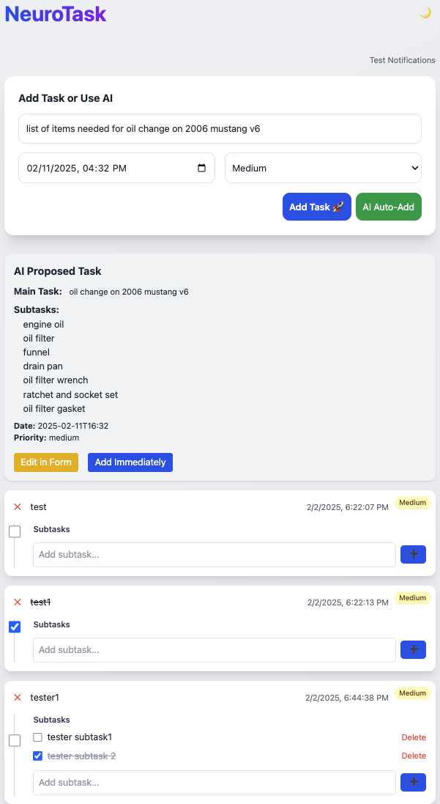

# NeuroTask - Smart Task Manager



A smart to-do list application with AI integration, priority management, and reminders. Designed for Raspberry Pi with web interface access.

## Features

- 📝 Create tasks with due dates and priorities (Low/Medium/High)  
- 🤖 AI-powered task creation (auto-add main task + subtasks from a single prompt)  
- 🎨 Dark/Light mode toggle  
- 🔔 Desktop notifications for due tasks  
- ✅ Task completion tracking  
- 📱 Mobile-friendly interface (responsive grid prevents field overlap)  
- 🔄 Real-time sync across devices

## Prerequisites

- Raspberry Pi 4 (Recommended)
- Python 3.9+
- Node.js 16+
- OpenAI API Key
- Basic familiarity with terminal commands

## Installation

1. Clone Repository
```bash
ssh pi@<your-pi-ip>
git clone https://github.com/nastradacha/neuro-task.git
cd neuro-task
```
2. Python Setup
```bash
python3 -m venv venv
source venv/bin/activate
pip install -r requirements.txt
```
3. Frontend Setup
```bash
# Install Node.js
curl -fsSL https://deb.nodesource.com/setup_16.x | sudo -E bash -
sudo apt install -y nodejs

# Build CSS
npm install
npx tailwindcss -i ./static/main.css -o ./static/output.css --watch
```
4. Configuration
```bash
cp .env.example .env
nano .env  # Add OpenAI API key
```

### System Service (Auto-start)
```bash
sudo nano /etc/systemd/system/neurotask.service
```

Add the following content:
```ini
[Unit]
Description=NeuroTask Service
After=network.target redis-server.service

[Service]
User=pi
WorkingDirectory=/home/pi/neuro-task
EnvironmentFile=/home/pi/neuro-task/.env
ExecStart=/home/pi/neuro-task/venv/bin/gunicorn -w 4 -b 0.0.0.0:5000 app:app
Restart=always

[Install]
WantedBy=multi-user.target
```

```bash
sudo systemctl daemon-reload
sudo systemctl enable neurotask.service
sudo systemctl start neurotask.service
```

## Usage

- Access web interface: `http://<your-pi-ip>:5000`
- Add tasks by typing a description, date/time, and priority
- Or enter an AI prompt (e.g. “items needed to cook jollof”) and click AI Auto-Add
- Toggle dark mode with 🌓 button
- Manage tasks/subtasks with checkboxes, delete button, etc

## Troubleshooting

| Issue                      | Solution                                      |
|----------------------------|----------------------------------------------|
| Port 5000 in use           | `sudo lsof -i :5000` then `kill -9 PID`      |
| AI suggestions failing     | Verify OpenAI API key in `.env`              |
| Missing priority colors    | Rebuild CSS with `npx tailwindcss...`        |
| Can't connect via SSH      | Check Pi's IP with `hostname -I`             |

## Development
```bash
# Mac/Linux development setup
git clone https://github.com/<your-username>/neuro-task.git
python3 -m venv venv
source venv/bin/activate
pip install -r requirements.txt
flask run --debug
```

## License
MIT License

## Acknowledgments
- OpenAI API
- Flask Framework
- Tailwind CSS

---

# Additional Documentation

## Project Structure
```
neuro-task/
├── app.py                 # Main application
├── requirements.txt       # Python dependencies
├── static/
│   ├── main.css           # Tailwind source
│   └── output.css         # Compiled CSS
├── templates/
│   └── index.html         # Main interface
├── tasks.db               # SQLite database
└── .env                   # Configuration
```

## Database Schema
```sql
CREATE TABLE tasks
             (id INTEGER PRIMARY KEY,
              task TEXT,
              due_date TEXT,
              priority TEXT CHECK(priority IN ('low', 'medium', 'high')) DEFAULT 'medium',
              status TEXT DEFAULT 'pending', completed BOOLEAN DEFAULT 0);

CREATE TABLE subtasks (
        id INTEGER PRIMARY KEY,
        parent_task_id INTEGER NOT NULL,
        subtask TEXT NOT NULL,
        completed BOOLEAN DEFAULT 0,
        FOREIGN KEY (parent_task_id) REFERENCES tasks(id)
    );
```

## API Endpoints
| Endpoint                   | Method  | Description                           |
|----------------------------|---------|---------------------------------------|
| `/tasks`                   | GET     | List all tasks                        |
| `/tasks`                   | POST    | Create new task                       |
| `/tasks/<id>`              | DELETE  | Delete task                           |
| `/tasks/<id>/complete`     | PATCH   | Toggle task completion                |
| `/tasks/<id>/subtasks`     | GET     | List subtasks for given task          |
| `/tasks/<id>/subtasks`     | POST    | Create a new subtask for a task       |
| `/tasks/<id>/subtasks/<id>`| DELETE  | Delete a subtask                      |
| `/ai/autogen`              | POST    | AI auto-add main task + subtasks      |


## Maintenance Tips

### Backup Database
```bash
cp tasks.db tasks-backup-$(date +%F).db
```

### Update Dependencies
```bash
pip freeze > requirements.txt
```

### Monitor Logs
```bash
journalctl -u neurotask.service -f
```

### Security Recommendations
1. Change default Pi password
2. Use HTTPS with Let's Encrypt
3. Regular system updates:
   ```bash
   sudo apt update && sudo apt upgrade -y
   ```
4. Configure firewall:
   ```bash
   sudo ufw allow 5000
   sudo ufw enable
   ```

---

## How to Use
1. Create `README.md` in your project root.
2. Add screenshots to `docs/` folder.
3. Update placeholder values (GitHub URL, IP addresses).
4. Commit to repository:
   ```bash
   git add README.md
   git commit -m "Add project documentation"
   git push
   ```
